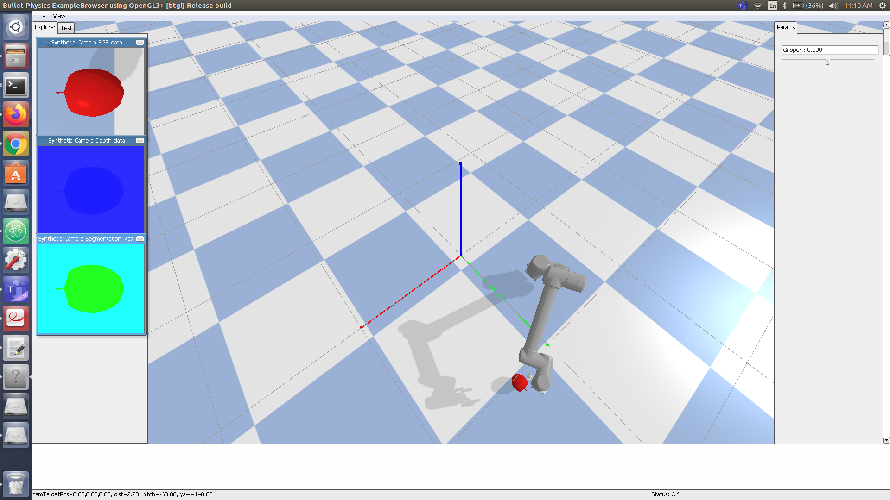

# Position Based Visual Servoing 

## Install Pybullet

```
pip install pybullet (or) pip3 install pybullet
```

## Run the code

```
python3 pbvs.py
```




## Progress

1. [Differential Drive](diff_drive)